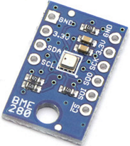

# BME280
BOSCH BME280 combined humidity and pressure sensor driver for TiJOS

| 条目         | 说明                          |
| ---------- | --------------------------- |
| 驱动名称       | BME280 压力传感器                |
| 适用         | 该驱动适用于BME280 压力传感器          |
| 通讯方式       | I2C                         |
| Java Class | TiBME280.java               |
| 图片         |  |

